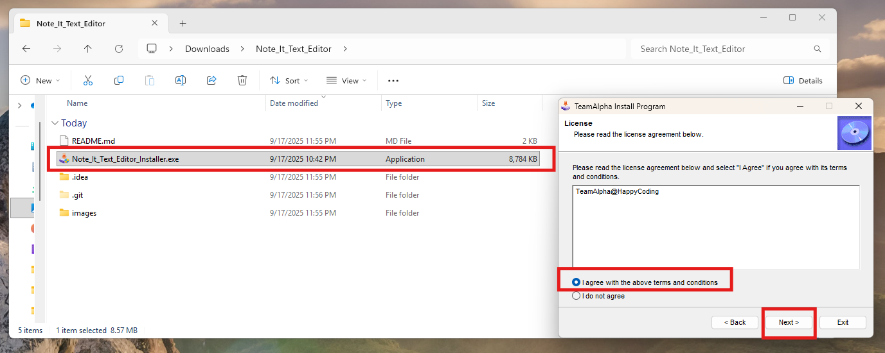
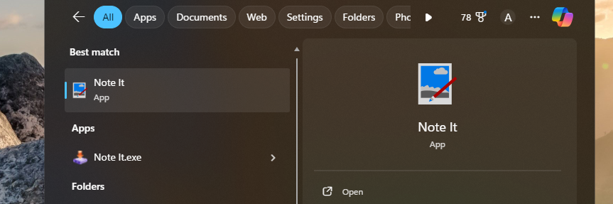
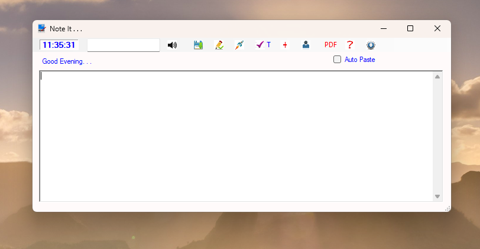
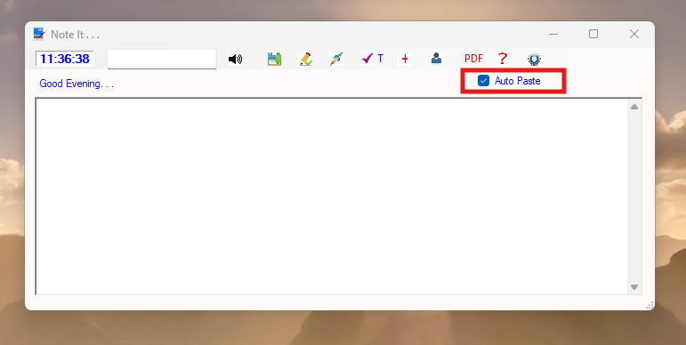
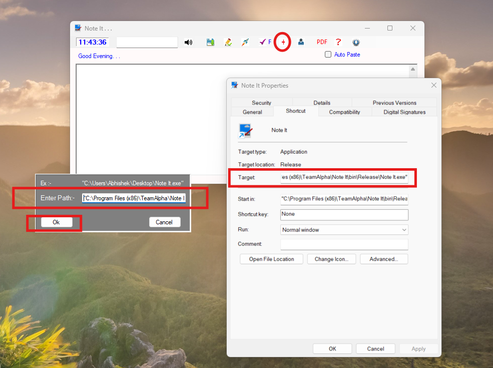
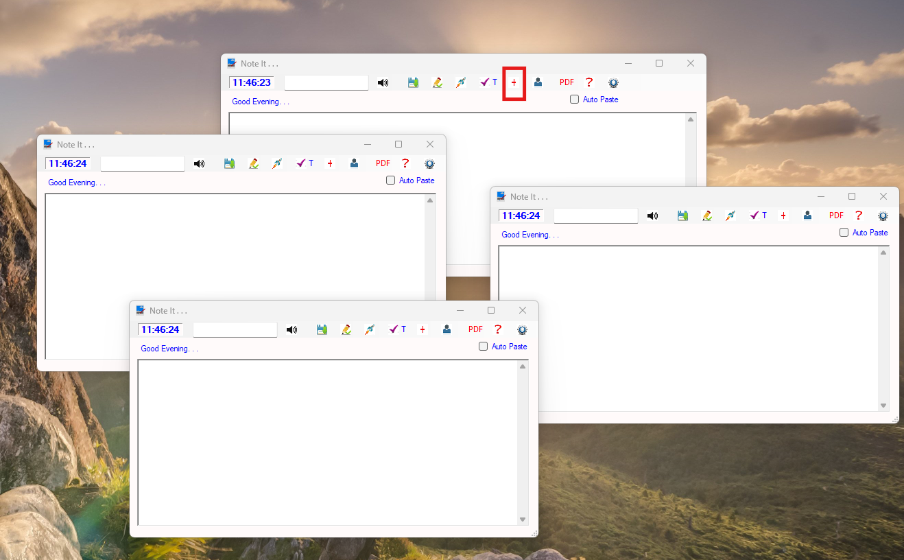
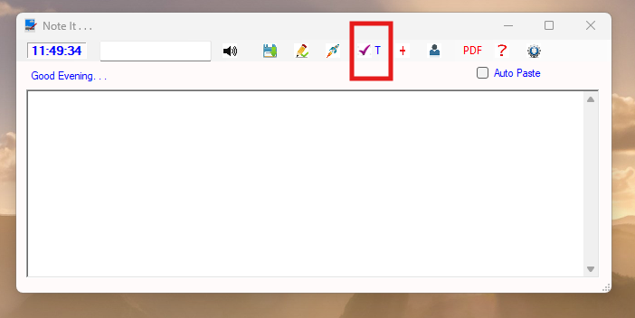
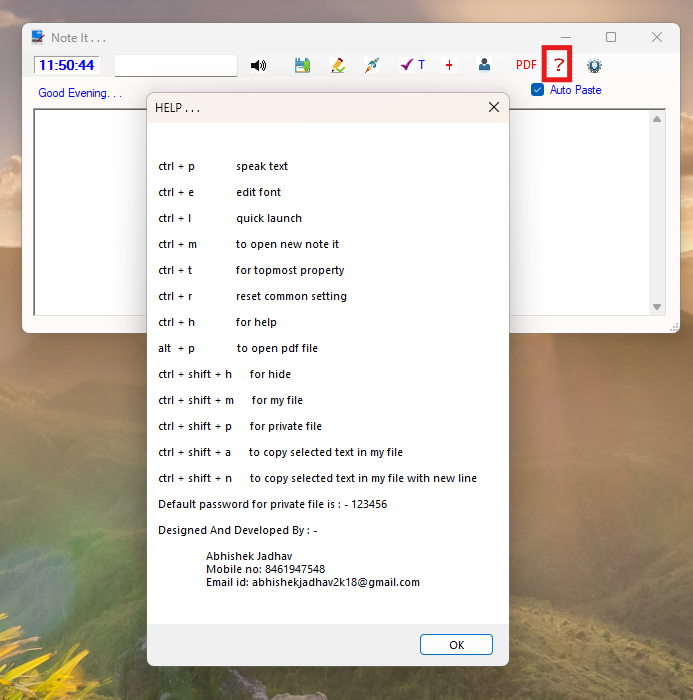
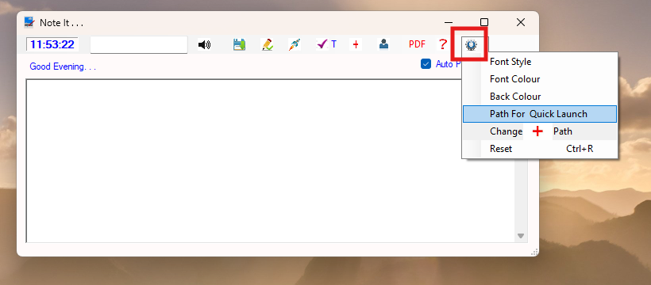

**Note It** is a lightweight text editor, with an auto-paste facility, and a topmost view option. We can paste the copied text automatically by selecting the Auto Paste option. This option will also work even when the application is in minimized mode. We can use the my\_file and private\_file options for storing information and passwords.

**Note It** provides a font style picker and color picker for font and background color.

**Note It** is very helpful to copy selected contents from a PDF or website, and also useful to take notes while watching a video lecture.

**Note It** provides a quick launching option to open an app using a launching button, and it also allows you to open multiple **Note It** instances.

**Install Note It**
Run the installer file Note_It_Text_Editor_Installer.exe

**After installation search for Note It**

**Home Page**

**Auto Paste Option**

**Setup to launch multiple Note It instances**

**After that we can use this option to launch multiple instances**

**Top view option, select T to enable**

**Open help details** 

**Open Settings**

